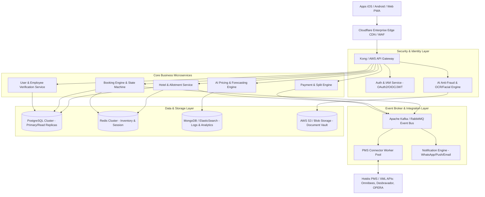
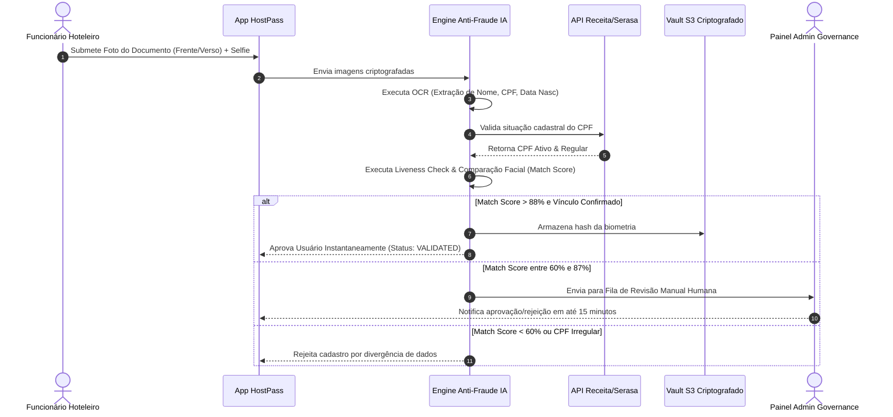

# 03. Software Architecture, AI Engines & Cybersecurity
## Plataforma de Permuta Hoteleira (StaffStay / HostPass)

---

## 1. Topologia de Arquitetura de Microsserviços

A plataforma utiliza uma arquitetura baseada em **Microsserviços Desacoplados**, conteinerizada com **Docker** e orquestrada via **Kubernetes (EKS/GKE)**, operando em modelo **Cloud Native Multi-Region** de altíssima escalabilidade e resiliência.



---

## 2. Estratégia de Escalabilidade e Alta Disponibilidade

### 1. Camada de Edge & Cache Distribuidor
- **CDN Cloudflare Enterprise:** Terminação TLS 1.3, mitigação de DDoS ilimitada (Layer 3, 4 e 7), caching dinâmico de páginas estáticas e otimização de imagens (WebP/AVIF).
- **Redis Cluster (In-Memory Data Store):**
  - Caching de diárias, inventários de allotment e tabela de preços com TTL curto (15 a 60 segundos).
  - Bloqueio atômico de quartos (Distributed Locks via Redlock) durante o checkout para **eliminar condições de corrida (Race Conditions) e Overbooking**.

### 2. Auto-scaling & Resiliência Kubernetes (HPA/VPA)
- Pods configurados com **Horizontal Pod Autoscaler (HPA)** baseados em uso de CPU/Memória e vazão de requisições por segundo (RPS).
- Capacidade de escalar automaticamente de 10 para 500 pods em menos de 90 segundos durante campanhas de flash sales ou abertura de allotment de feriados.

### 3. Fila e Desacoplamento Orientado a Eventos (Kafka)
- Processamento assíncrono de notificações, sincronização com PMS legados, geração de comprovantes em PDF e emissão de vouchers QR Code via workers de fila Kafka sem bloquear o fluxo do cliente final.

---

## 3. Motores de Inteligência Artificial & Machine Learning

```
┌────────────────────────────────────────────────────────────────────────────────────────┐
│                               MOTORES DE INTELIGÊNCIA ARTIFICIAL                       │
├────────────────────────────────────────────────────────────────────────────────────────┤
│ 1. MOTOR DE IDENTIDADE E ANTI-FRAUDE BIOMÉTRICA                                        │
│    • OCR Inteligente: Extração automática de dados de RG, CNH e Passaporte via OpenCV. │
│    • Liveness Check (Prova de Vida): Análise de micro-movimentos em vídeo/selfie.      │
│    • Biometria Facial: Vetorização facial (128 pontos nodais) e comparação com doc.    │
│    • Risk Score Behavioral: Algoritmo de cruzamento de reputação do IP, CPF e e-mail.  │
├────────────────────────────────────────────────────────────────────────────────────────┤
│ 2. MOTOR DE DEMAND FORECASTING E RECOMMENDED PRICING                                   │
│    • Algoritmo de Regressão XG Boost + LSTM para prever taxa de ocupação dos hotéis.   │
│    • Sugestão dinâmica do piso de tarifa de permuta para otimizar revPAR e A&B.        │
│    • Alerta inteligente de liberação de Allotment enviado ao Revenue Manager do hotel. │
├────────────────────────────────────────────────────────────────────────────────────────┤
│ 3. AGENTE CONVERSACIONAL E CHATBOT CX (LLM)                                            │
│    • Atendimento 100% automatizado para hóspedes e hotéis via WhatsApp e Webchat.      │
│    • Resposta instantânea sobre políticas de cancelamento, horário de check-in e voucher.│
└────────────────────────────────────────────────────────────────────────────────────────┘
```

### Detalhamento do Fluxo de Validação de Identidade Biométrica:



---

## 4. Segurança da Informação, LGPD & Compliance

### 1. Conformidade com a LGPD (Lei Geral de Proteção de Dados - Lei 13.709/2018)
- **Princípio da Minimização:** Coleta estrita dos dados necessários para validação do vínculo hoteleiro e emissão de reservas.
- **Anonimização e Hash de Documentos:** Documentos de identidade e biometrias faciais não são armazenados em texto puro. As imagens de documentos são criptografadas em vault S3 com chave KMS individual e as biometrias são convertidas em vetores matemáticos unidirecionais (hashes).
- **Portal de Privacidade do Usuário (LGPD Self-Service):**
  - Solicitação de exportação de dados (Right to Data Portability) em formato JSON.
  - Solicitação de exclusão definitiva da conta (Right to be Forgotten) com expurgo automatizado em 30 dias.
  - Gestão de consentimento explicito de cookies e comunicações de marketing.

### 2. Conformidade com PCI-DSS (Payment Card Industry Data Security Standard)
- **Escopo Reduzido (SAQ A):** NENHUM dado de cartão de crédito passa ou é armazenado pelos servidores da HostPass.
- Toda a captura de cartão é realizada via **Iframes/SDKs tokenizados** do gateway de pagamento (Mercado Pago / Pagar.me), que nos retorna apenas um token temporário reutilizável (`card_token`).

### 3. Criptografia & Protocolos de Comunicação
- **Dados em Trânsito:** Obrigatoriedade de HTTPS/TLS 1.3 com Perfect Forward Secrecy (PFS) e HSTS habilitado.
- **Dados em Repouso:** Criptografia de banco de dados PostgreSQL via AWS RDS Storage Encryption (AES-256) e volumes S3 criptografados com AWS KMS.

### 4. Controle de Acesso Baseado em Perfis (RBAC - Role-Based Access Control)
- **HOTEL_ADMIN:** Acesso exclusivo ao painel do próprio hotel, gestão de inventário e extrato financeiro.
- **HOTEL_STAFF:** Acesso restrito a visualização de reservas do dia e validação de vouchers QR Code.
- **USER_VERIFIED:** Acesso ao aplicativo de busca e reserva B2C.
- **SUPER_ADMIN:** Acesso ao painel governamental da plataforma com trilha de auditoria completa de cada ação.

### 5. Trilha de Auditoria Inviolável (Audit Trail)
- Registro imutável de logs no Elasticsearch de todas as operações administrativas (alteração de tarifas, aprovação manual de usuários, estornos e alterações de permissões) contendo: `timestamp`, `user_id`, `ip_address`, `action`, `old_value`, `new_value`.
