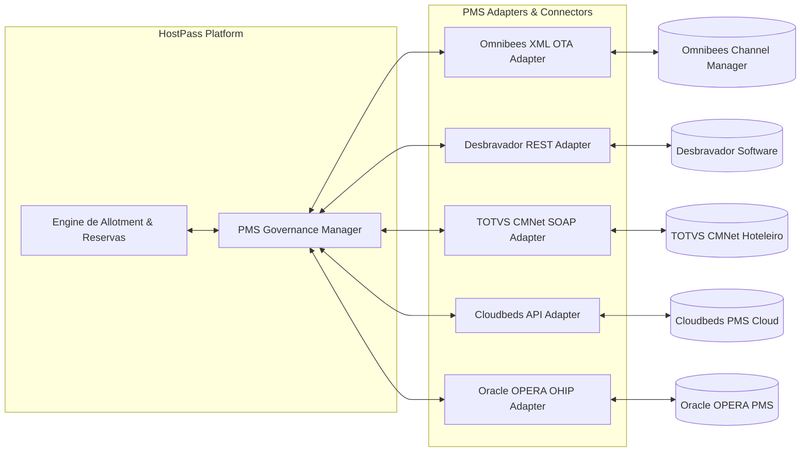

# 04. API Specifications & PMS Integration Engine
## Plataforma de Permuta Hoteleira (StaffStay / HostPass)

---

## 1. Especificação de APIs RESTful (OpenAPI v3)

A plataforma disponibiliza uma API RESTful estruturada para consumo dos aplicativos móveis, web app e integrações B2B de parceiros.

### Visão Geral dos Principais Endpoints:

| Método | Endpoint | Descrição | Autenticação |
|---|---|---|---|
| **POST** | `/api/v1/auth/login` | Autenticação de Usuário e Hotel (Retorna JWT) | Pública |
| **POST** | `/api/v1/users/register` | Cadastro de Funcionário com upload de docs | Pública |
| **POST** | `/api/v1/users/verify-biometry` | Envio de selfie + prova de vida para validação IA | Bearer JWT |
| **GET** | `/api/v1/hotels/search` | Busca de hotéis com suporte a filtros e geolocalização | Bearer JWT |
| **GET** | `/api/v1/hotels/{id}/allotment` | Consulta de disponibilidade e tipos de quartos | Bearer JWT |
| **POST** | `/api/v1/bookings/create` | Criação de reserva com trava de allotment no Redis | Bearer JWT |
| **POST** | `/api/v1/payments/checkout` | Processamento do pagamento (Pix / Split Cartão) | Bearer JWT |
| **GET** | `/api/v1/bookings/{id}/voucher` | Emissão de Voucher digital com QR Code assinado | Bearer JWT |
| **POST** | `/api/v1/checkin/digital-scan` | Validação de QR Code no check-in da recepção | Bearer Hotel |
| **POST** | `/api/v1/hotel-panel/allotment/update` | Atualização de allotment pelo hotel (Manual) | Bearer Hotel |

---

### Exemplo JSON de Payload: Endpoint `POST /api/v1/bookings/create`

```json
{
  "hotel_id": "htl_78945612",
  "room_type_id": "room_deluxe_ocean_view",
  "check_in": "2026-08-15",
  "check_out": "2026-08-18",
  "guests_count": 2,
  "primary_guest": {
    "full_name": "Pedro Henrique Pereira",
    "cpf": "123.456.789-00",
    "employee_registration_id": "EMP-88492"
  },
  "add_ons": [
    {
      "add_on_id": "addon_breakfast_daily",
      "quantity": 2
    },
    {
      "add_on_id": "addon_late_checkout_16h",
      "quantity": 1
    }
  ],
  "payment_method": "PIX",
  "insurance_included": true
}
```

### Exemplo JSON de Resposta: `201 Created`

```json
{
  "success": true,
  "data": {
    "booking_id": "bk_9988112233",
    "reservation_code": "HOST-7749-BRL",
    "status": "CONFIRMED",
    "pricing_summary": {
      "nightly_rate": 120.00,
      "total_nights": 3,
      "subtotal_room": 360.00,
      "add_ons_total": 90.00,
      "service_fee": 36.00,
      "insurance_fee": 18.00,
      "total_amount": 504.00,
      "currency": "BRL"
    },
    "split_allocation": {
      "hotel_share": 450.00,
      "platform_fee_share": 54.00
    },
    "qr_code_voucher_url": "https://api.staffstay.com/v1/vouchers/qr_9988112233.png",
    "expires_at": "2026-08-15T14:00:00Z"
  }
}
```

---

## 2. Camada de Integração de PMS & Connectors

A **HostPass** possui uma arquitetura de conectores de PMS (Channel Manager Gateway) preparada para se conectar aos principais sistemas hoteleiros do mercado.



### Detalhamento das Integrações por Fornecedor:

#### 1. Omnibees (API XML / OTA Protocol)
- **Método de Comunicação:** XML sobre HTTPS (OTA Standard - Open Travel Alliance).
- **Mensagens Suportadas:**
  - `OTA_HotelAvailNotifRQ`: O hotel envia atualizações de disponibilidade de allotment.
  - `OTA_HotelRateAmountNotifRQ`: Atualização de tarifas do canal privado.
  - `OTA_HotelResNotifRQ`: A plataforma notifica o Omnibees sobre a reserva concluída para inserção automática no mapa de ocupação do hotel.

#### 2. Desbravador (REST API / Webhooks)
- **Sincronização Bidirecional:** Polling a cada 5 minutos de disponibilidade de UH (Unidades Habitacionais) e envio instantâneo de vouchers confirmados via Webhook JSON.

#### 3. TOTVS CMNet (SOAP / XML Direct Connector)
- Suporte a servidores CMNet legados via conector proxy seguro (Tunneling TLS) instalado no ambiente do hotel para atualização de grid de reservas e contas a receber.

#### 4. Cloudbeds (OAuth 2.0 REST API)
- Conexão nativa Cloud-to-Cloud via API REST v1.2 da Cloudbeds com mapeamento de `Room Types` e criação automática de reservas com a tag "STAFFSTAY_PRIVATE_CHANNEL".

#### 5. Oracle OPERA (OHIP - Opera Hospitality Integration Platform)
- Conexão padrão enterprise via GraphQL/REST OHIP para grandes redes de resorts e hotéis luxo.

---

## 3. Algoritmo Inteligente de Controle de Allotment

```
  ┌─────────────────────────────────────────────────────────────────────────────┐
  │                 ALGORITMO AUTOMÁTICO DE ALLOTMENT INTELIGENTE              │
  └─────────────────────────────────────────────────────────────────────────────┘
                                       │
                  ┌────────────────────┴────────────────────┐
                  ▼                                         ▼
     [ MODULO 1: ALLOTMENT FIXO ]             [ MODULO 2: ALLOTMENT DINÂMICO ]
     O hotel define manualmente N             O sistema monitora a ocupação do
     quartos por dia com preço fixo.          PMS. Se ocupação em D-7 for < 40%,
                                              libera + 5 quartos no StaffStay.
```

### Regras de Execução do Algoritmo de Allotment:

1. **Prevenção Absoluta de Overbooking (Distributed Lock):**
   - Ao selecionar uma diária, o quarto fica em estado `HELD` no Redis por 10 minutos durante o pagamento.
   - Se o pagamento não for confirmado em 10 minutos, a chave do Redis expira e o allotment retorna imediatamente ao inventário disponível.

2. **Liberação de Emergência (Last-Minute Yield Optimization):**
   - Faltando **72 horas para a data de check-in**, se o hotel parceiro estiver com ocupação geral abaixo de 35%, o motor de IA envia um alerta ao Revenue Manager recomendando liberar 3 a 5 quartos adicionais com tarifa de custo marginal.

3. **Gatilhos de Notificação Automática (Alertas Inteligentes):**
   - Quando o Allotment disponível de um hotel atinge **0 quartos** para uma data procurada, o sistema dispara notificação via Push e WhatsApp ao gestor do hotel perguntando: *"Você tem 12 solicitações de profissionais para o próximo fim de semana. Deseja liberar mais 2 quartos?"* com botão de aprovação rápida em 1-clique.
